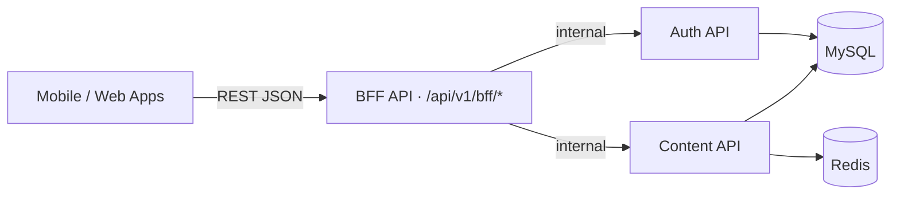

# Eventoando API Docs

> **Eventoando** — Brazil's marketplace connecting event organizers with service providers (photographers, buffets, DJs, decorators, and more).

[](https://www.eventoando.com.br/api/v1/health)
[](LICENSE)

---

## Quick Start

### 1. Register & Login

```bash
# Register
curl -X POST https://www.eventoando.com.br/api/v1/bff/auth/register \
  -H "Content-Type: application/json" \
  -d '{
    "name": "João Silva",
    "email": "joao@example.com",
    "password": "secret123",
    "termsAccepted": true
  }'

# Login → returns accessToken + refreshToken
curl -X POST https://www.eventoando.com.br/api/v1/bff/auth/login \
  -H "Content-Type: application/json" \
  -d '{"email": "joao@example.com", "password": "secret123"}'
```

### 2. Create an Event

```bash
curl -X POST https://www.eventoando.com.br/api/v1/bff/events \
  -H "Authorization: Bearer <accessToken>" \
  -H "Content-Type: application/json" \
  -d '{
    "title": "Casamento João e Maria",
    "description": "Recepção com 150 convidados",
    "eventType": "private",
    "eventDate": "2026-12-20T18:00:00.000Z",
    "guestCount": 150
  }'
```

### 3. Browse Providers & Request Budget

```bash
# List public provider listings by region
curl "https://www.eventoando.com.br/api/v1/bff/advertisements/public?regionId=<uuid>"

# Request budget from a provider
curl -X POST https://www.eventoando.com.br/api/v1/bff/budgets \
  -H "Authorization: Bearer <accessToken>" \
  -H "Content-Type: application/json" \
  -d '{"eventId": "<event-uuid>", "advertisementId": "<ad-uuid>"}'
```

---

## Base URL

```
https://www.eventoando.com.br/api/v1
```

All authenticated endpoints require:
```
Authorization: Bearer <accessToken>
```

All responses follow the envelope:
```json
{ "data": { ... }, "total": 42, "metadata": { ... } }
```

---

## Architecture



**Rule:** client apps talk exclusively to the BFF. Auth API and Content API are not publicly accessible.

See [docs/architecture.md](docs/architecture.md) for full details.

---

## Endpoint Reference

| Method | Path | Description | Auth |
|--------|------|-------------|------|
| **Auth** | | | |
| POST | `/bff/auth/register` | Register new user | ❌ |
| POST | `/bff/auth/login` | Login | ❌ |
| POST | `/bff/auth/refresh` | Refresh access token | ❌ |
| GET  | `/bff/auth/me` | Current user profile | ✅ |
| POST | `/bff/auth/reset-password` | Request password reset | ❌ |
| POST | `/bff/auth/social-login` | OAuth social login | ❌ |
| POST | `/api/v1/auth/request-otp` | Request OTP | ❌ |
| POST | `/api/v1/auth/verify-otp` | Verify OTP | ❌ |
| **Events** | | | |
| GET  | `/bff/events/upcoming` | Upcoming public events | ❌ |
| GET  | `/bff/events/my-events` | My events | ✅ |
| POST | `/bff/events` | Create event | ✅ |
| GET  | `/bff/events/:id` | Get event | ✅ |
| PUT  | `/bff/events/:id` | Update event | ✅ |
| DELETE | `/bff/events/:id` | Delete event | ✅ |
| POST | `/bff/events/:id/publish` | Publish event | ✅ |
| POST | `/bff/events/:id/cancel` | Cancel event | ✅ |
| POST | `/bff/events/:id/payments/checkout` | Pay for event | ✅ |
| POST | `/bff/events/calculator/calculate` | Estimate cost | ✅ |
| **Advertisements** | | | |
| GET  | `/bff/advertisements/public` | Public provider listings | ❌ |
| GET  | `/bff/advertisements/my-advertisements` | My listings | ✅ |
| POST | `/bff/advertisements` | Create listing | ✅ |
| GET  | `/bff/advertisements/:id` | Get listing | ✅ |
| PUT  | `/bff/advertisements/:id` | Update listing | ✅ |
| POST | `/bff/advertisements/:id/publish` | Publish listing | ✅ |
| POST | `/bff/advertisements/:id/activate` | Activate listing | ✅ |
| GET  | `/bff/advertisements/rankings` | Top-ranked listings | ❌ |
| **Catalog** | | | |
| GET  | `/bff/catalog/:adId/items` | List catalog items | ✅ |
| POST | `/bff/catalog/:adId/items` | Add item | ✅ |
| PUT  | `/bff/catalog/:adId/items` | Update items | ✅ |
| DELETE | `/bff/catalog/:adId/items/:itemId` | Remove item | ✅ |
| **Budgets** | | | |
| GET  | `/bff/budgets` | List budgets | ✅ |
| POST | `/bff/budgets` | Request budget | ✅ |
| PATCH | `/bff/budgets/:id/accept` | Accept budget | ✅ |
| PATCH | `/bff/budgets/:id/reject` | Reject budget | ✅ |
| DELETE | `/bff/budgets/:id` | Delete budget | ✅ |
| **Negotiations** | | | |
| GET  | `/bff/negotiations/my-negotiations` | My negotiations | ✅ |
| POST | `/bff/negotiations` | Create negotiation | ✅ |
| POST | `/bff/negotiations/:id/accept` | Accept | ✅ |
| POST | `/bff/negotiations/:id/decline` | Decline | ✅ |
| POST | `/bff/negotiations/:id/generate-payment` | Generate payment | ✅ |
| POST | `/bff/negotiations/:id/cancel` | Cancel | ✅ |
| POST | `/bff/negotiations/:id/finalize` | Finalize deal | ✅ |
| PATCH | `/bff/negotiations/:id/finalize-price` | Lock price | ✅ |
| POST | `/bff/negotiations/:id/extend` | Request extension | ✅ |
| POST | `/bff/negotiations/:id/messages` | Send message | ✅ |
| **Payments** | | | |
| POST | `/bff/payments` | Create payment | ✅ |
| GET  | `/bff/payments/my-payments` | My payments | ✅ |
| POST | `/bff/payments/:id/confirm` | Confirm delivery | ✅ |
| POST | `/bff/payments/:id/release` | Release escrow | ✅ |
| POST | `/bff/payments/:id/refund` | Request refund | ✅ |
| POST | `/bff/payments/:id/cancel` | Cancel payment | ✅ |
| GET  | `/bff/payouts/balance` | Provider balance | ✅ |
| POST | `/bff/payouts` | Request payout | ✅ |
| GET  | `/bff/payouts/my` | My payouts | ✅ |
| **Ratings** | | | |
| POST | `/bff/ratings` | Submit rating | ✅ |
| GET  | `/bff/ratings/provider/:id` | Provider ratings | ❌ |
| GET  | `/bff/ratings/event/:id` | Event ratings | ✅ |
| **Notifications** | | | |
| GET  | `/bff/notifications` | List | ✅ |
| GET  | `/bff/notifications/unread` | Unread count | ✅ |
| PATCH | `/bff/notifications/:id/read` | Mark read | ✅ |
| POST | `/bff/notifications/read-all` | Mark all read | ✅ |
| **Media** | | | |
| POST | `/bff/media/upload` | Upload file | ✅ |
| GET  | `/bff/media/:id` | Get media | ✅ |
| DELETE | `/bff/media/:id` | Delete media | ✅ |
| **Discovery** | | | |
| GET  | `/bff/discovery/nearby` | Nearby providers | ✅ |
| POST | `/bff/discovery/geocode` | Geocode address | ✅ |
| GET  | `/bff/discovery/matches/pending` | Pending matches | ✅ |
| **Reference Data** | | | |
| GET  | `/bff/categories` | Categories | ✅ |
| GET  | `/bff/regions/active` | Active regions | ❌ |
| GET  | `/bff/event-types/active` | Active event types | ❌ |
| GET  | `/bff/addresses/cep/:cep` | Lookup postal code | ✅ |
| **Public** | | | |
| GET  | `/bff/public/stats` | Platform statistics | ❌ |
| GET  | `/bff/public/advertisements` | Public ad feed | ❌ |
| GET  | `/bff/public/categories` | Categories | ❌ |
| GET  | `/bff/public/regions` | Regions | ❌ |
| POST | `/bff/waitlist` | Join waitlist | ❌ |
| **Guests** | | | |
| POST | `/bff/guests` | Add guest | ✅ |
| GET  | `/bff/guests/event/:eventId` | Event guest list | ✅ |
| PATCH | `/bff/guests/:id/status` | Update status | ✅ |
| POST | `/bff/guests/:id/send-invitation` | Send invite | ✅ |
| POST | `/bff/guests/check-in-by-token` | Check-in | ❌ |
| **Health** | | | |
| GET  | `/health` | Health check | ❌ |
| GET  | `/health/ready` | Readiness | ❌ |

---

## Guides

- [Getting Started](docs/getting-started.md) — auth + first request walkthrough
- [Authentication](docs/authentication.md) — JWT, OTP, refresh tokens
- [Organizer Flow](docs/guides/organizer-flow.md) — create event → quotes → pay
- [Advertiser Flow](docs/guides/advertiser-flow.md) — create listing → receive requests → close
- [Payment & Escrow](docs/guides/payment-flow.md) — MercadoPago + escrow model
- [Regions & Zones](docs/guides/regions-zones.md) — geographic service area model
- [Error Handling](docs/error-handling.md) — error codes + retry strategy

---

## OpenAPI Spec

Full spec at [`schema/openapi.yaml`](schema/openapi.yaml).

```bash
# Validate
npx @redocly/cli lint schema/openapi.yaml

# Preview interactive docs
npx @redocly/cli preview-docs schema/openapi.yaml
```

---

## Using as AI Context

See [SKILL.md](SKILL.md) for using this repo as context in Claude Code / Cowork.

Issues and PRs welcome. Docs are [MIT licensed](LICENSE).
